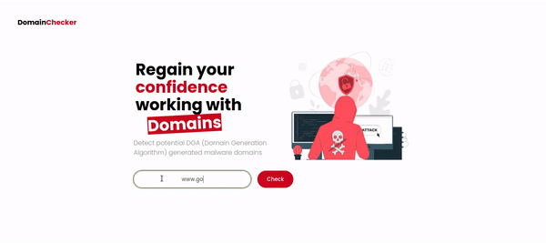

# **Domain Checker 🌐**

## ✔️ **Description** 📑
___
The aim of this project is to build a machine leraning classifier web app  which can help us detect a potential machines infected by the DGA (Domain Generation Algorithm) malware.
Typically machines that are infected tend to generate a bunch of random domain names which will contain one active C&C server.
  
This application guides users on 
detecting potential DGA (Domain Generation Algorithm) generated malware domains
to avoid maleware attack also other numerous purposes including educational purposes.

<!--  -->

## **✔️ Libraries and tools 🛠️**
___

<a href="https://code.visualstudio.com/" target="_blank"> 
    
    
    
    
    
    
    
    
    
    

##  **✔️ Tech stack**
___
    * Python 
    * flask
    * Numpy
    * Matplotlib
    * Seaborn
    * Pandas 
    * Scikit-learn
    * nltk
    * Joblib
    * Docker 
    * AWS

## **✔️ Deployment 🚀**
___
This app was containerized with the docker contrainer and the app image was pushed to docker hub and deployed on [AWS](https://aws.amazon.com/)

**Link to Domain Checker web app : [Domain checker app](#)**

**Link to Domain Checker docker image : [Domain checker app image](https://hub.docker.com/repository/docker/bestnyah/domain-checker)**

## **✔️ Project Organization 📌**
___
    DOMAIN CHECKER
    .
    ├── app.py
    ├── config.py
    ├── dataset
    │   └── dga_data.csv
    ├── model_build_binary_class.ipynb
    ├── models
    │   ├── trained_rf_dga_classifier.sav
    │   └── Xtrain.pkl
    ├── __pycache__
    │   ├── config.cpython-310.pyc
    │   └── utils.cpython-310.pyc
    ├── README.md
    ├── static
    │   ├── css
    │   │   └── main.css
    │   └── hero_img.svg
    ├── sub_class_model.ipynb
    ├── templates
    │   ├── index.html
    │   └── predict.html
    └── utils.py
